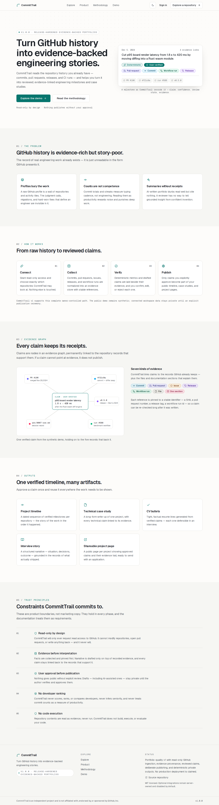
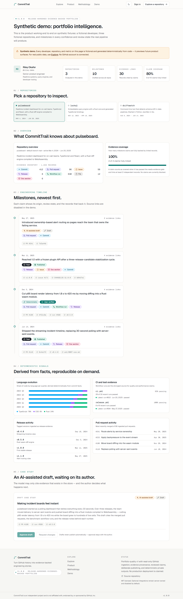
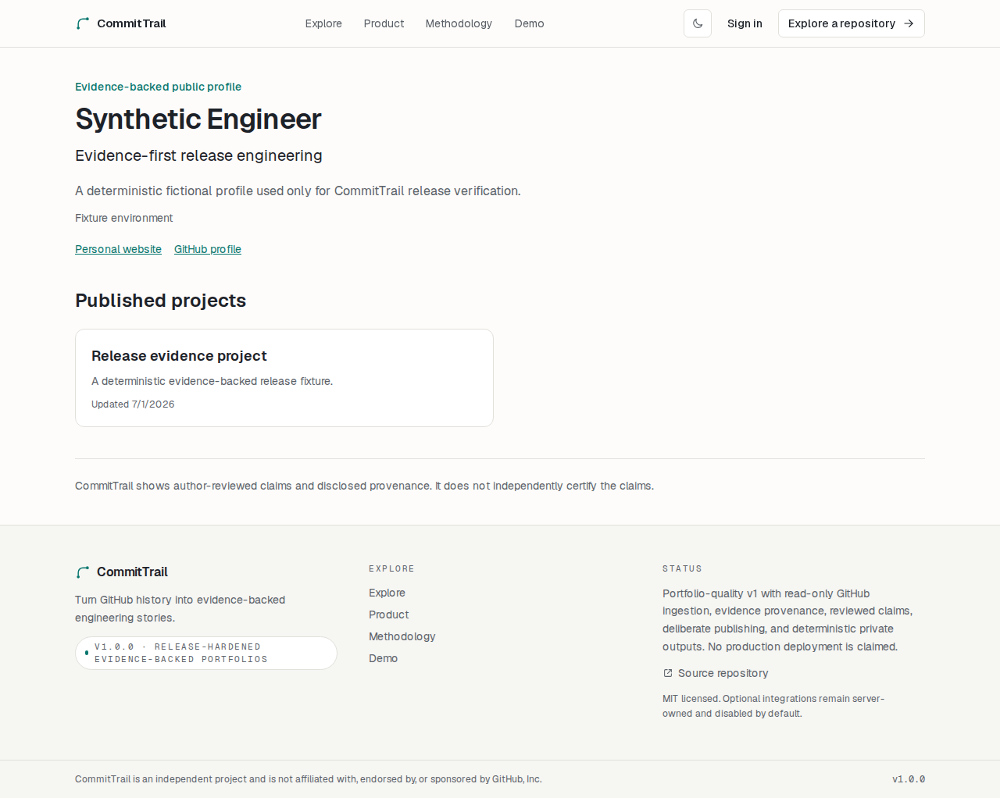
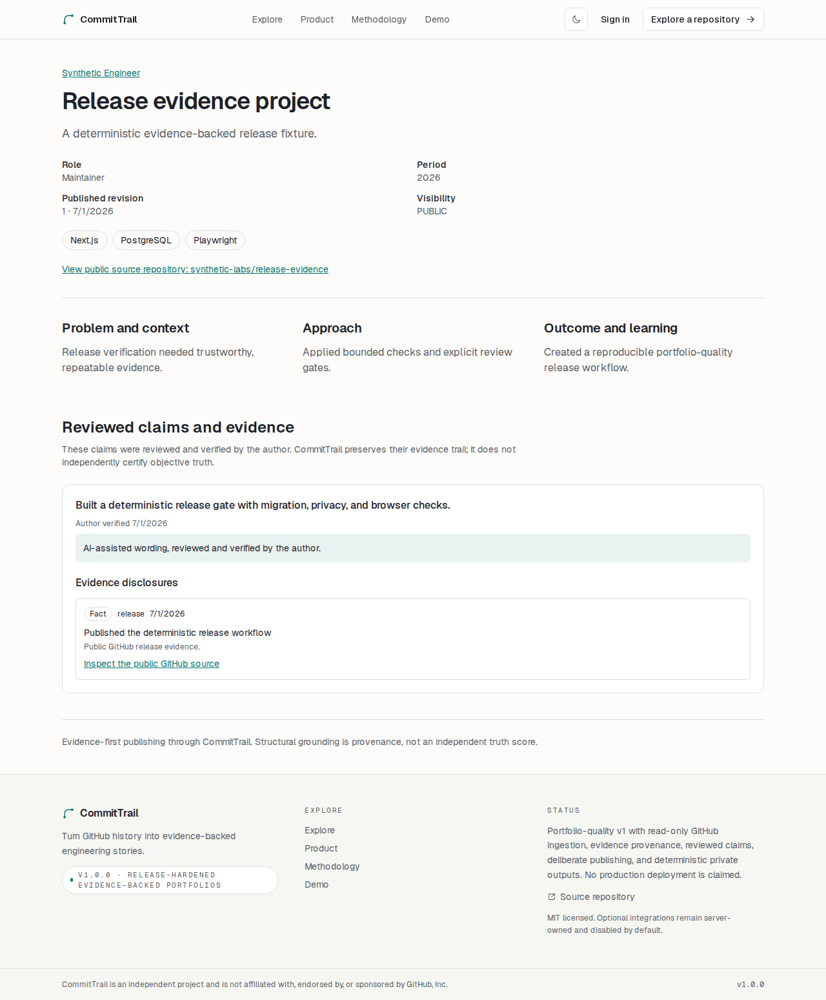
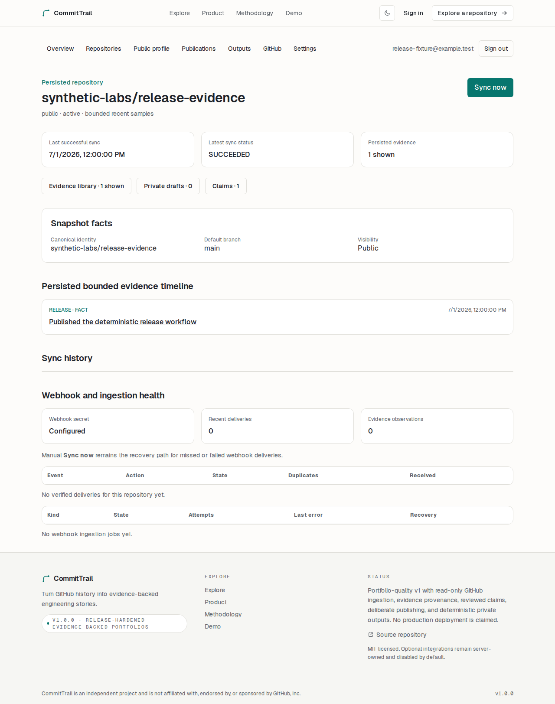

# CommitTrail

**Evidence-backed engineering stories, with provenance and owner control.**

CommitTrail turns bounded GitHub facts into an inspectable evidence graph,
human-reviewed claims, deliberately published project revisions, and private
portfolio outputs. It does not rank developers, infer seniority, equate commit
counts with productivity, or silently publish generated text.

[](https://github.com/tahagurvardar/committrail/actions/workflows/ci.yml)
[](https://github.com/tahagurvardar/committrail/actions/workflows/codeql.yml)
[](LICENSE)
[](https://committrail.vercel.app)

Try the **[Public Demo](https://committrail.vercel.app)**. Account and private
workspace features are disabled, and `/demo` contains deterministic synthetic
data. Full functionality is available through the local full-mode setup below.

## Product tour

| Landing                                                          | Synthetic demo                                                      |
| ---------------------------------------------------------------- | ------------------------------------------------------------------- |
|  |  |

| Public profile                                                                      | Published project                                                                        |
| ----------------------------------------------------------------------------------- | ---------------------------------------------------------------------------------------- |
|  |  |



All screenshots are generated by Playwright from fictional `.example.test`
fixtures. They contain no production account, repository, claim, token, or
personal data.

## Capabilities

- Account-free, read-only exploration of public repository facts and bounded
  recent activity.
- Clearly labeled, deterministic synthetic full-product demo.
- Private Better Auth workspace with a verified read-only GitHub App.
- Minimal HMAC-verified webhook envelopes, a durable PostgreSQL queue, bounded
  retries, idempotent reconciliation, and provenance-preserving evidence.
- Human-authored claims and optional grounded suggestions that require selected
  evidence, remain private, and never auto-verify.
- Deliberate publication of immutable PUBLIC or UNLISTED revisions containing
  only explicitly reviewed claims and evidence projections.
- Deterministic private case-study, CV-bullet, and interview-story outputs.
- Health checks, strict browser headers, sanitized diagnostics, config and
  migration validation, guarded maintenance/restore tooling, and graceful
  workers.

See the [methodology](docs/methodology.md), [architecture](docs/architecture.md),
[security and privacy model](docs/security-and-privacy.md), and
[authorization matrix](docs/authorization-matrix.md).

## Routes

| Route                                      | Purpose                                          |
| ------------------------------------------ | ------------------------------------------------ |
| `/`, `/about`, `/methodology`              | Product scope, boundaries, and methodology       |
| `/explore`, `/repositories/[owner]/[repo]` | Account-free public GitHub facts                 |
| `/demo`                                    | Fictional deterministic full-product preview     |
| `/login`, `/register`, `/dashboard/*`      | Private account and workspace                    |
| `/profiles/[slug]`                         | Indexed PUBLIC profile and projects              |
| `/projects/[slug]`                         | Immutable PUBLIC or exact-link UNLISTED revision |
| `/api/health/live`, `/api/health/ready`    | Sanitized process/readiness probes               |

## Trust boundaries

- Browsers never call GitHub directly. Visitor input is parsed as repository
  identity and requests use a fixed GitHub API origin.
- Fetches are read-only, page-one, size-capped, timeout-bounded, and normalized.
  Raw payloads, commit email/body, issue body, logs, diffs, and source files are
  not retained.
- GitHub 404 remains “not found or not publicly accessible.” Partial upstream
  failure never becomes an invented conclusion.
- Evidence is fact-labeled and sampled; transparent arithmetic is never
  presented as quality, productivity, maturity, or developer performance.
- Owner actions scope database predicates to the authenticated workspace.
  Unauthorized and absent private resources share generic responses.
- Publishing is an explicit ceremony. Private repository identifiers and source
  links are redacted from public snapshots.
- External drafting requires explicit provider-specific consent. No provider is
  needed for evidence, publishing, or outputs.

## Local development

Requires Node 22, npm 10, and PostgreSQL 17. Development and test databases must
be separate.

```bash
cp .env.example .env.local
npm ci
npm run db:migrate:deploy
npm run dev
```

The public explorer can run without a GitHub token. A server-only, no-scope
`GITHUB_TOKEN` is optional for a larger public API allowance. Private features
need the database/auth/encryption values and GitHub App configuration described
in [`.env.example`](.env.example) and
[GitHub App setup](docs/github-app-setup.md).

## Verification

```bash
npm run config:check
npm run db:validate
npm run db:verify
npm run format:check
npm run lint
npm run typecheck
npm run test:unit
npm run test:integration
npm run test:e2e
npm run build
npm run release:check
```

E2E uses a disposable database whose URL must contain `test`. Global setup
clears only that database, registers through the real auth API, and seeds
fictional deterministic records. Projects cover Chromium desktop and a
375-pixel mobile viewport. The suite includes critical workflows, privacy
boundaries, security headers, accessibility, screenshots, and regression
performance budgets.

CI runs Node 22/npm 10 with PostgreSQL 17. It pins actions by commit, uses
least-privilege permissions, separates browser tests, cancels superseded runs,
runs CodeQL, and checks the runtime audit. The runtime dependency audit is clean
at v1.0.0; the time-bounded development-toolchain audit exception is documented
in [SECURITY.md](SECURITY.md).

## Operations and deployment

- [Operations runbook](docs/operations.md)
- [Database backup and restore](docs/backup-and-restore.md)
- [Deployment preparation](docs/deployment.md)
- [Accessibility verification](docs/accessibility.md)
- [Performance budgets](docs/performance.md)
- [Release checklist](docs/release-checklist.md)

`APP_MODE=public-demo` is a database-free, read-only presentation mode that
blocks auth and private product surfaces. `APP_MODE=full` requires PostgreSQL,
the web process, and a separate ingestion worker. No deployment is implied by
this repository or release.

## Project policy

CommitTrail 1.0.0 is available under the [MIT license](LICENSE). Read
[CONTRIBUTING.md](CONTRIBUTING.md), [CODE_OF_CONDUCT.md](CODE_OF_CONDUCT.md),
[SUPPORT.md](SUPPORT.md), [SECURITY.md](SECURITY.md), and
[CHANGELOG.md](CHANGELOG.md) before participating.

CommitTrail is independent and is not affiliated with, endorsed by, or
sponsored by GitHub, Inc.

## Known limitations

Activity is a bounded recent sample rather than complete history. The project
does not fetch diffs, source files, comments, review content, logs, artifacts,
or archives. There is no billing, team collaboration, email delivery, hosted
queue, scheduler, or automatic webhook redelivery. Deployment, backup retention,
restore drills, provider data handling, and comprehensive assistive-technology
testing remain operator responsibilities.
